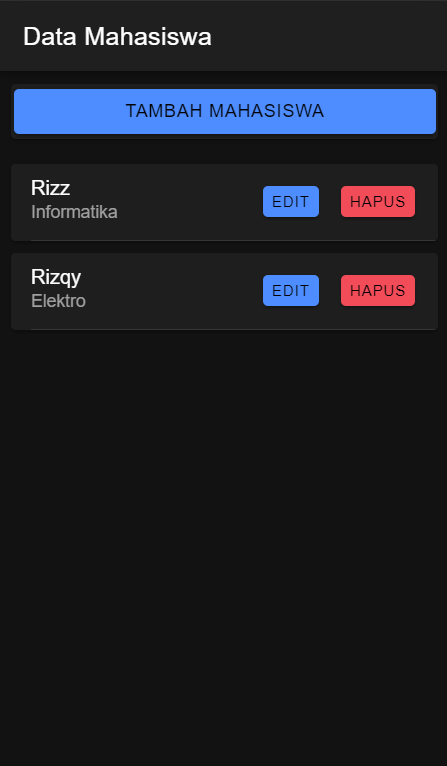
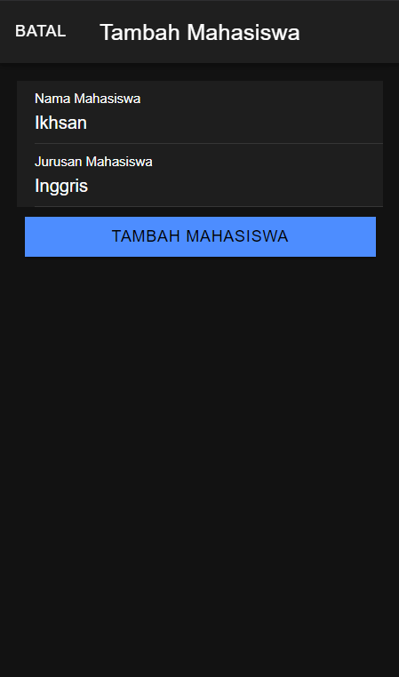
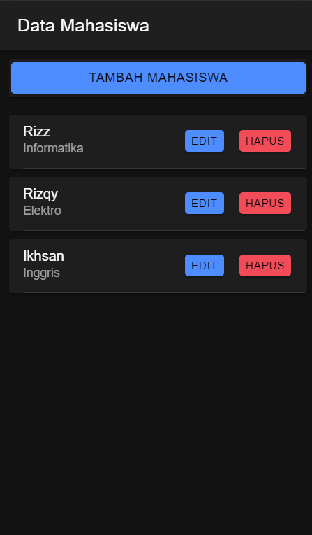

# Pertemuan 9 Tugas 8 Praktikum Pemrograman Mobile
Nama    : Rizky Budi Saputra
NIM     : H1D022047
Shift Lama D, Shift Baru F

## API
API diatur di api.service.ts yang di dalamnya ada 6 fungsi
- apiURL : URL dasar 
- tambah : Menambah data dengan metode POST
- edit : Update data dengan metode PUT
- tampil : View data dengan metode GET
- hapus : Hapus data dengan metode DELETE
- lihat : View data sesuai id dengan metode GET
```ts
import { Injectable } from '@angular/core';
import { HttpClient } from '@angular/common/http';
import { Observable } from 'rxjs';

@Injectable({
  providedIn: 'root'
})
export class ApiService {

  constructor(private http: HttpClient) { }

  apiURL() {
    return 'http://localhost/mahasiswa';
  }

  tambah(data: any, endpoint: string) {
    return this.http.post(this.apiURL() + '/' + endpoint, data);
  }

  edit(data: any, endpoint: string) {
    return this.http.put(this.apiURL() + '/' + endpoint, data);
  }

  tampil(endpoint: string): Observable<any> {
    return this.http.get(this.apiURL() + '/' + endpoint);
  }

  hapus(id: any, endpoint: string) {
    return this.http.delete(this.apiURL() + '/' + endpoint + '' + id);
  }

  lihat(id: any, endpoint: string) {
    return this.http.get(this.apiURL() + '/' + endpoint + '' + id);
  }
}
```

## CRUD Mahasiswa
### View


Metode untuk view adalah
```ts
getMahasiswa() {
    this.api.tampil('tampil.php').subscribe({
      next: (res: any) => {
        console.log('sukses', res);
        this.dataMahasiswa = res;
      },
      error: (err: any) => {
        console.log(err);
      },
    });
  }
```
Dan ditampilkan dengan 
```html
<ion-content [fullscreen]="true">
  <ion-header collapse="condense">
    <ion-toolbar>
      <ion-title size="large">Data Mahasiswa</ion-title>
    </ion-toolbar>
  </ion-header>

  <ion-card *ngFor="let item of dataMahasiswa">
    <ion-item>
      <ion-label>
        {{item.nama}}
        <p>{{item.jurusan}}</p>
      </ion-label>
      <ion-button color="danger" slot="end" (click)="confirmHapusMahasiswa(item.id)">Hapus</ion-button>
      <ion-button expand="block" (click)="openModalEdit(true,item.id)">Edit</ion-button>
    </ion-item>
  </ion-card>
</ion-content>
```

### Create


Klik tombol tambah
```html
<ion-card>
  <ion-button (click)="openModalTambah(true)" expand="block">Tambah Mahasiswa</ion-button>
</ion-card>
```
Akan memunculkan modal
```html
<ion-modal [isOpen]="modalTambah" (ionModalDidDismiss)="cancel()">
  <ng-template>
    <ion-header>
      <ion-toolbar>
        <ion-buttons slot="start">
          <ion-button (click)="cancel()">Batal</ion-button>
        </ion-buttons>
        <ion-title>Tambah Mahasiswa</ion-title>
      </ion-toolbar>
    </ion-header>
    <ion-content class="ion-padding">
      <ion-item>
        <ion-input label="Nama Mahasiswa" labelPlacement="floating" required [(ngModel)]="nama"
          placeholder="Masukkan Nama Mahasiswa" type="text">
        </ion-input>
      </ion-item>
      <ion-item>
        <ion-input label='Jurusan Mahasiswa' labelPlacement="floating" required [(ngModel)]="jurusan"
          placeholder="Masukkan Jurusan Mahasiswa" type="text">
        </ion-input>
      </ion-item>
      <ion-row>
        <ion-col>
          <ion-button type="button" (click)="tambahMahasiswa()" color="primary" shape="full" expand="block">Tambah
            Mahasiswa
          </ion-button>
        </ion-col>
      </ion-row>
    </ion-content>
  </ng-template>
</ion-modal>
```
Metodenya adalah 
```ts
tambahMahasiswa() {
    if (this.nama != '' && this.jurusan != '') {
      let data = {
        nama: this.nama,
        jurusan: this.jurusan,
      }
      this.api.tambah(data, 'tambah.php')
        .subscribe({
          next: (hasil: any) => {
            this.resetModal();
            console.log('berhasil tambah mahasiswa');
            this.getMahasiswa();
            this.modalTambah = false;
            this.modal.dismiss();
          },
          error: (err: any) => {
            console.log('gagal tambah mahasiswa');
          }
        })
    } else {
      console.log('gagal tambah mahasiswa karena masih ada data yg kosong');
    }
  }
```
Hasilnya


### Edit


Klik tombol edit akan muncul modal
```html
<ion-button expand="block" (click)="openModalEdit(true,item.id)">Edit</ion-button>
<ion-modal [isOpen]="modalEdit" (ionModalDidDismiss)="cancel()">
  <ng-template>
    <ion-header>
      <ion-toolbar>
        <ion-buttons slot="start">
          <ion-button (click)="cancel()">Batal</ion-button>
        </ion-buttons>
        <ion-title>Edit Mahasiswa</ion-title>
      </ion-toolbar>
    </ion-header>
    <ion-content class="ion-padding">
      <ion-item>
        <ion-input label="Nama Mahasiswa" labelPlacement="floating" required [(ngModel)]="nama"
          placeholder="Masukkan Nama Mahasiswa" type="text">
        </ion-input>
      </ion-item>
      <ion-item>
        <ion-input label='Jurusan Mahasiswa' labelPlacement="floating" required [(ngModel)]="jurusan"
          placeholder="Masukkan Jurusan Mahasiswa" type="text">
        </ion-input>
      </ion-item>
      <ion-input required [(ngModel)]="id" type="hidden">
      </ion-input>
      <ion-row>
        <ion-col>
          <ion-button type="button" (click)="editMahasiswa()" color="primary" shape="full" expand="block">Edit
            Mahasiswa
          </ion-button>
        </ion-col>
      </ion-row>
    </ion-content>
  </ng-template>
</ion-modal>
```
Metodenya adalah 
```ts
editMahasiswa() {
    let data = {
      id: this.id,
      nama: this.nama,
      jurusan: this.jurusan
    }
    this.api.edit(data, 'edit.php')
      .subscribe({
        next: (hasil: any) => {
          console.log(hasil);
          this.resetModal();
          this.getMahasiswa();
          console.log('berhasil edit Mahasiswa');
          this.modalEdit = false;
          this.modal.dismiss();
        },
        error: (err: any) => {
          console.log('gagal edit Mahasiswa');
        }
      })
  }
```


Saat klik hapus akan menggunakan metode confirmHapusMahasiswa yang akan membuat modal konfirmasi. Kalau klik batal akan tidak jadi dan kalau klik hapus akan lanjut ke hapusMahasiswa
```html
<ion-button color="danger" slot="end" (click)="confirmHapusMahasiswa(item.id)">Hapus</ion-button>
```
```ts
async confirmHapusMahasiswa(id: any) {
    const alert = await this.alertController.create({
      header: 'Konfirmasi Hapus',
      message: 'Yakin ingin menghapus data ini?',
      buttons: [
        {
          text: 'Batal',
          role: 'cancel',
          handler: () => {
            console.log('Penghapusan dibatalkan');
          }
        },
        {
          text: 'Hapus',
          handler: () => {
            this.hapusMahasiswa(id);
          }
        }
      ]
    });
    await alert.present();
  }


  hapusMahasiswa(id: any) {
    this.api.hapus(id,
      'hapus.php?id=').subscribe({
        next: (res: any) => {
          console.log('sukses', res);
          this.getMahasiswa();
          console.log('berhasil hapus data');
        },
        error: (error: any) => {
          console.log('gagal');
        }
      })
  }
```